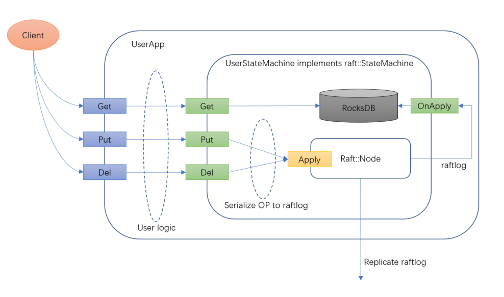
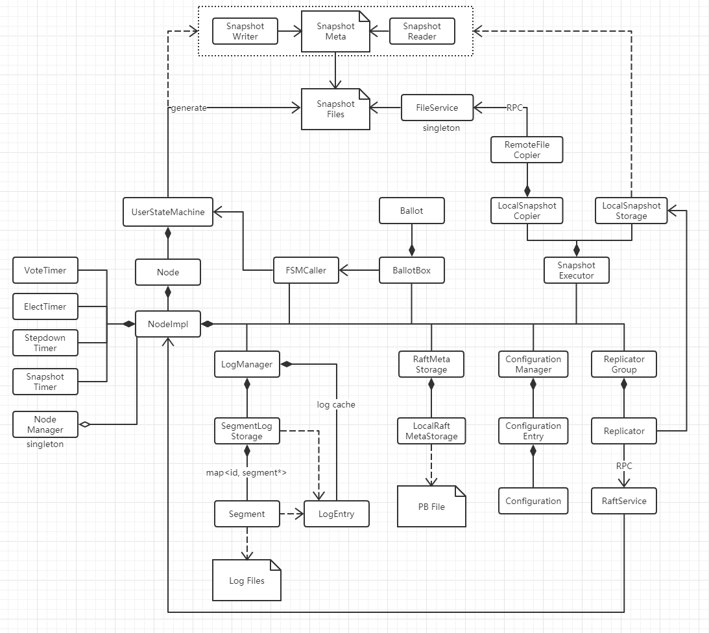
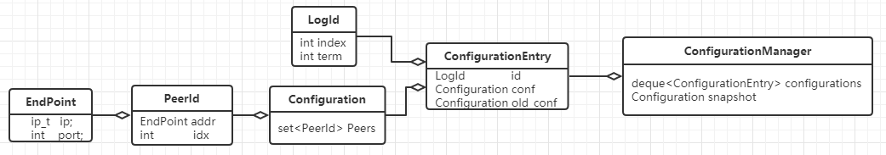
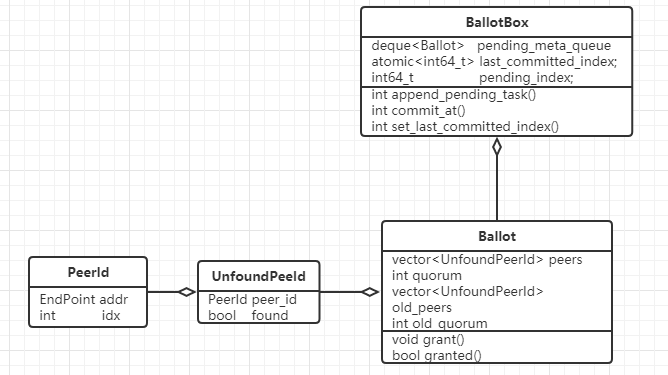
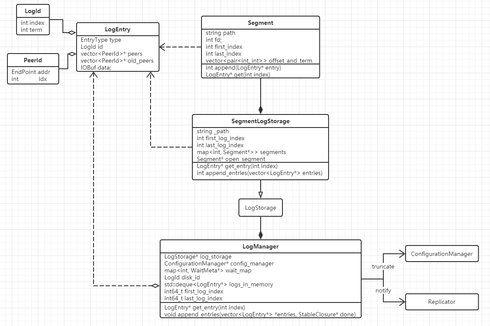
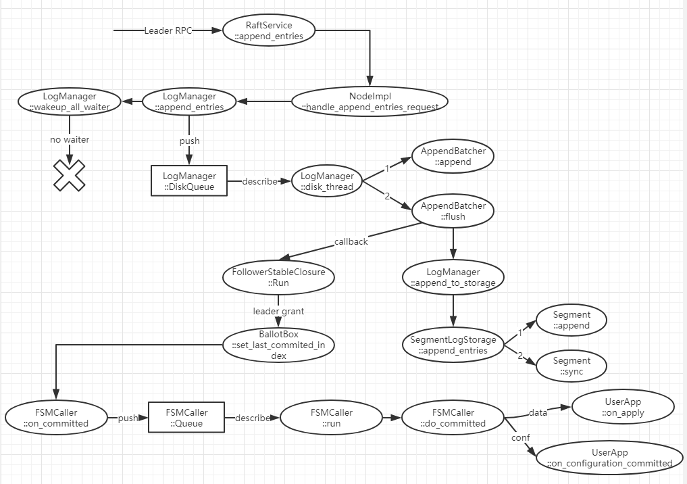
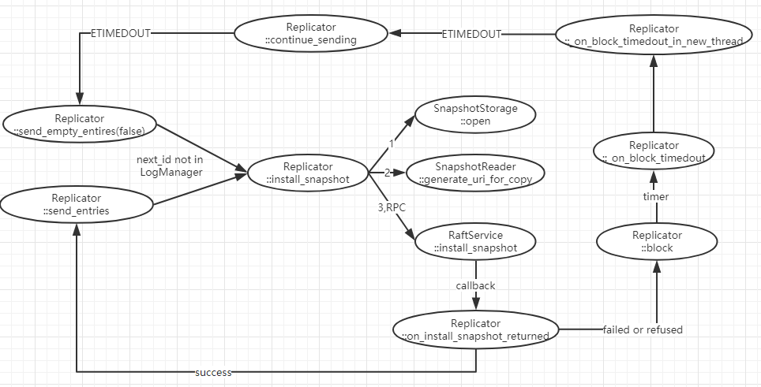
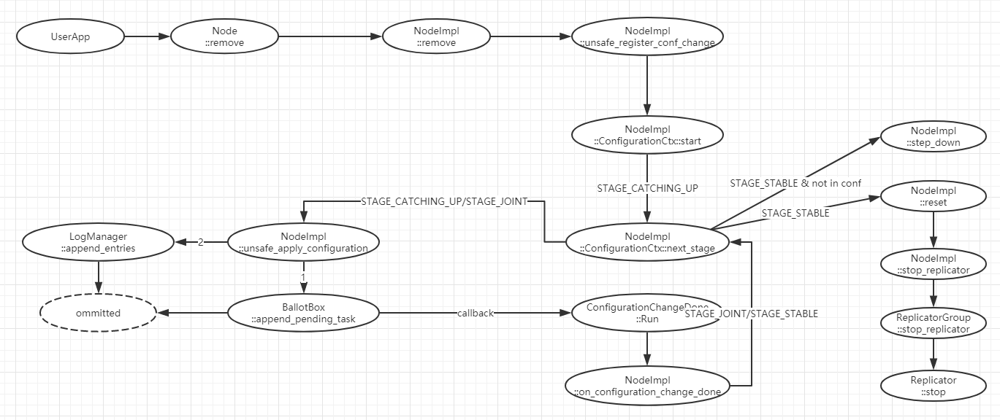
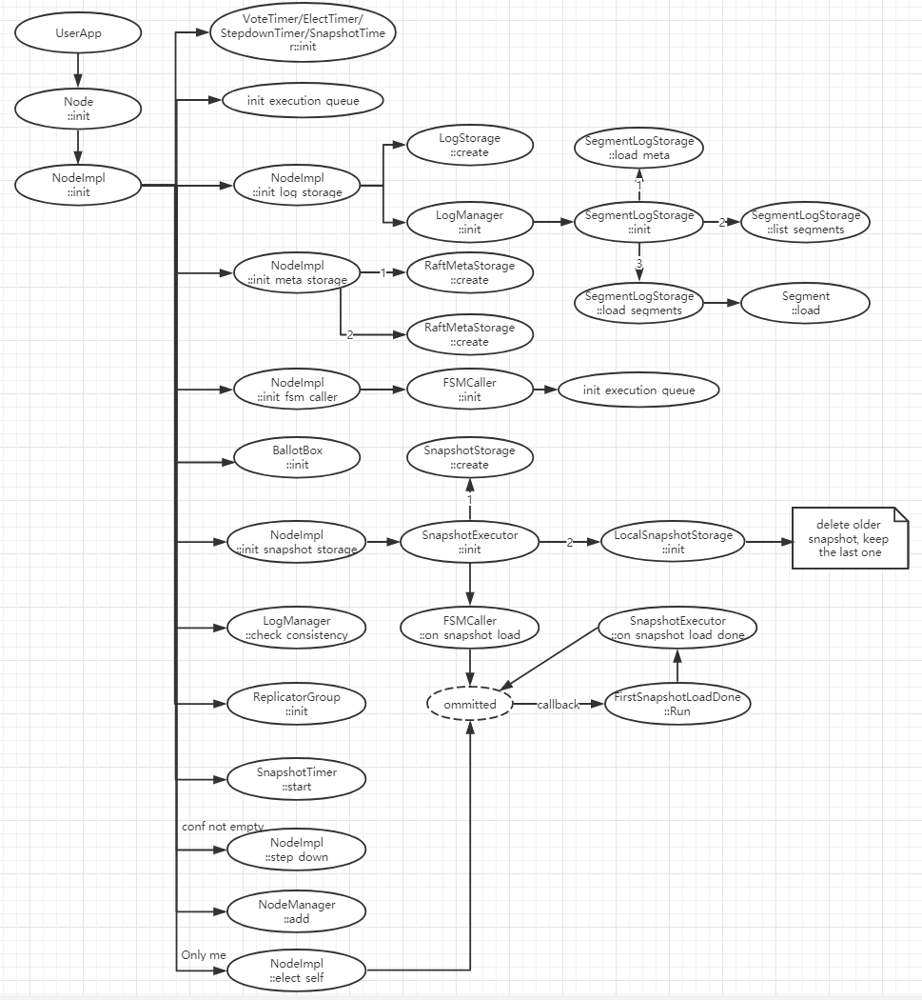

# Braft详解

[TOC]

## 1. 概述

[Braft](https://github.com/brpc/braft)是百度最新开源的，使用[Brpc](https://github.com/brpc/brpc)开发的，基于[Raft协议](https://raft.github.io/)实现的分布式一致协议库。Braft在百度内部的CDS、BlobStorage、TafDB、BRDB等多个生产环境中得到了大规模的应用，取得了良好的效果。相比其他开源的C++语言Raft协议库，Braft更加全面、成熟、稳定，是我们研究Raft协议及其实现的很好的着手点。

## 2. 名词解释

* **Brpc**：百度开源的一种基于protobuf开发的RPC编程框架，支持m:n的协程模型。
* **Raft协议**：一种分布式一致性协议，由斯坦福的Diego Ongaro和John Ousterhout提出，比Paxos更容易理解和实现。
* **Leader**：Raft协议使用多个副本保存数据，其中有一个负责对外读写并分发Raft日志的副本被称为Leader。
* **Follower**：Raft协议中多副本中非Leader的其他副本。
* **UserStateMachine**：Braft是一个协议库，只完成Raft日志的分发并保证一致性。因此，使用时用户需要继承其StateMachine接口，实现on_commit、on_snapshot_save等多个方法共同完成存储功能。这个用户继承实现的StateMachine被称为UserStateMachine（用户状态机）。
* **Snapshot**：为了避免Raft日志占用过多磁盘空间以及加速数据恢复，Raft协议需要用户定期做Snapshot。在Braft中Snapshot由UserStateMachine产生，并交给Braft去复制给需要的Follower。
* **Stepdown**：Braft中的副本遇到异常之后的回退清理行为。

## 3. 整体介绍

### 3.1. Braft的使用

如上图所示，用户使用Braft加上RocksDB做了了一套自己的三副本kv存储系统。

首先，用户需要实现raft::StateMachine这个接口，其中包含OnApply、OnSnapshot等必须实现的方法，以及OnLeaderStart等可选的方法。为了实现kv逻辑，UserStateMachine需要对外暴露Get/Put/Del这三个接口。此外，在这个UserEngine中还需要包含一个raft::Node的对象以及一个RocksDB的对象，UserStateMachine实例化的时候必须同时实例化raft::Node和RocksDB。

然后，用户在UserStateMachine的外面再实现一个用于接收RPC或者Restful Req的UserApp。这个UserApp负责接收它的Client发送来的Get/Put/Del请求，经过一定的处理之后（比方说权限管理），Get请求直接被UserStateMachine传递给RocksDB，查询本地后返回；PUT/DEL请求序列化为二进制string后调用raft::Node的Apply走分布式一致性逻辑，当这条raftlog被大多数从副本接受后，raft::Node调用UserStateMachine的OnApply接口将Put/Del操作应用在RocksDB上。

### 3.2. Braft的整体结构

Braft的类图如下：（忽略了很多小的数据结构）

主要的类功能简要介绍如下：

* **Node**：可以认为是NodeImpl的外壳或者接口，主要的功能都由NodeImpl实现。
* **NodeImpl**：Braft的核心类，调度、参与几乎所有的核心逻辑。
* **VoteTimer**：当一个Candidate发起vote时激活此timer，确保如果本次Vote无结果，Candidate将再次发起下一次vote。
* **ElectTimer**：Follower激活此timer，当收到Leader的心跳或者raft日志时更新NodeImpl中的timestamp，ElectTimer定期检查是否超时，超时则发起Vote流程。
* **StepdownTimer**：Leader激活此timer，定期检查Leader是否无法收到大多数副本的回复，如果是则执行Stepdown，让别的副本自行选主（也就是SDCP中的PrimaryLease，比较可惜的是Braft使用的超时时长为election_timeout）。
* **SnapshotTimer**：每个Active的副本都激活此timer，用于定期做Snapshot。
* **FSMCaller**：用来回调UserStateMachine的类，在回调之前还处理一些自有逻辑。
* **Ballot**：投票，用来记录一次RaftLog的复制或者Vote的情况的类。
* **BallotBox**：Ballot的管理类，RaftLog复制时会一次性复制多条，同时可能还有很多正在等待回复的Ballot，所以需要这个管理类。
* **LogManager**：RaftLog的接口、管理类，其他类都通过LogMananger来与RaftLog打交道。
* **LogEntry**：一条内存中的RaftLog，LogManager中有一个成员变量是RaftLog的Cache。
* **SegmentLogStorage**：RaftLog存储的管理类，管理Segment。
* **Segment**：一个Segment对应一个磁盘上的RaftLog文件。
* **RaftMetaStorage**：Raft副本元数据存储的管理类，负责论文中vote for、term的本地存储。
* **LocalRaftMetaStorage**：Raft副本元数据存储类，使用ProtoBuf序列化存储。
* **ConfigurationManager**：Raft Configuration的管理类。
* **ConfigurationEntry**：Configuration的列表中的一项，包括Configuration变更的LogId以及新旧Configuration的内容。
* **Configuration**：记录了Raft复制组由哪些副本组成。
* **ReplicatorGroup**：Replicator的管理类。
* **Replicator**：RaftLog复制的操作类，一个follower对应一个Replicator。使用RaftService的client发出AppendEnties等RPC请求，由LogManager来通知它是否有新RaftLog的到来。
* **RaftService**：与Replicator对应的RPC server，接收到请求后交给NodeImpl处理。
* **SnapshotExecutor**：Snapshot的管理类。
* **LocalSnapshotStorage**：Snapshot的存储类，实际上它只是持有一个路径，实际Snapshot的生成由UserStateMachine完成，然后再把文件列表交给LocalSnapshotStorage管理。
* **LocalSnapshotCopier**：Snapshot的复制类，调用RemoteFileCopier，根据Leader给的URI复制Snapshot数据到本地。
* **RemoteFileCopier**：通用的文件复制类，调用FileService的client，通过RPC复制文件。
* **FileService**：与RemoteFileCopier对应的RPC server。
* **LocalSnapshotWriter**：Snapshot的wrapper类，管理Snapshot文件之外，还负责Snapshot Meta数据的写入。
* **LocalSnapshotReader**：Snapshot的wrapper类，管理Snapshot文件之外，还负责Snapshot Meta数据的读取。

## 4. 设计详细介绍

### 4.1. NodeManager与NodeImpl

Braft支持在一台机器上启动多个raft node（多个node不同endpoint，以及多个node共享一个endpoint），并把这些raft node按照GroupId和PeerId分类，再使用NodeManager统一管理。

当RaftService收到RPC请求时，会根据请求中的GroupId和PeerId，将Request转发给指定的NodeImpl。

> 个人觉得NodeManager的设计思路是正确的，SDCP需要加入这个设计，以方便以后在一台机器上启动多个SDCP Node。

### 4.2. ConfigurationManager与Snapshot

ConfigurationManager是用来管理Configuration变更的类。在Braft中，复制组Configuration的变更通过Raft Log完成，ConfigurationManager建立LogId到Configuration的映射来跟踪记录这些变更。

也可以认为ConfigurationManager把Raft Log中的所有Configuration Log Entry全部单独抽出来管理，当LogManager truncate时它也跟着truncate；当做Snapshot时，也要把Snapshot的last logid对应的Configuration提取出来写到SnapshotMeta中。

为了防止重启时config log的丢失（已做snapshot后被truncate掉），所以在做snapshot时需要把当时的Configuration加入snapshot的meta中，而ConfigurationManager的snapshot就是对应这个做了snapshot的Configuration的内存中的暂存。

> 把conf加入snapshot是raft协议的要求，而且也能保证node重启之后的状态恢复。但是这要付出add_peer时，新加入的node会先apply一个错误的conf，然后从leader分发的raft log中再把最新的conf apply上去，在这两个时间之间，follower的conf是错误的。
>
> 个人认为，ConfigurationManager的设计是合理的，因为do_commited的线程和do_snapshot_save的线程是并发执行的，有可能在do_commited这个函数正好执行了一半，修改了nodeimpl的conf而又未增加last_applied_id时，并发do_snapshot_save，这时如果使用nodeimpl的conf就是错误的，应该用前一个版本的conf。

### 4.3. Ballot与BallotBox

Ballot记录了一次投票信息，而BallotBox是它的管理类。

Leader在向LogManager写入raft log之前，会调用append_pending_task在BallotBox中注册一个Ballot，在写成功之后会调用commit_at提交一次本地的投票。Replicator在分发成功之后，同样调用commit_at提交一次对应peer的投票。commit_at方法通过调用grant修改Ballot之中的信息，随后还使用granted检查投票是否通过。如果通过则修改last_commited_id，再调用FSMCaller的on_commit方法通知用户状态机。

除此之外，还有个pending_index，指的是BallotBox中应当提交的最小LogId（注意raft log的LogId都是连续的）。这个pending_index可以起到filter的作用，当Replicator使用较小的LogId调用时，可以帮助过滤掉无用的提交（举个例子：当一个node新当选为主之后，会把pending_index置为last_log_id+1。这样即使Replicator在向follower同步log，但是它的提交都会被filter掉。只有noop这个log才能进入BallotBox走提交逻辑，从而保证了论文中的noop提交前一个term的log的设计。）。

> 这个没什么好说的，常用的投票逻辑，只不过有两点需要仔细考虑：
>
> 1. last_committed_index记录在这里是否合适？
> 2. pending_index过滤的方法虽然巧妙但是理解困难，也许换成别的方法更好一些。

### 4.4. RaftMetaStorage

按照论文，MetaStorage中保存了node的vote_for和term信息，使用ProtoBuf序列化之后保存到指定的位置。当NodeImpl初始化时会读取这个文件并反序列化获取vote_for和term。vote_for和term只要有一项改动就立即写文件。

> SDCP还需要在vote_for和term的基础之上加入last_applied_id。

### 4.4. RaftLog

#### 4.4.1 Log file的设计

首先看看raft log的文件存储设计：

Braft的raft log都存储在用户指定的目录下，已经不再写入的log file命名规则是`log_$first_idx_$last_idx`，当前正在写入的log file命名规则是`log_inprogress_$first_idx`，其中first_idx和last_idx分别是log file中第一条raft log的index和最后一条的index。Log file完全由一条一条的log entry组成，既没有额外的footer和index，也没有做4k对齐，还没有使用magic number进行隔离。

Log entry由header和data两部分组成。header大小为24bytes：

* Term(64bits)：记录了log的term。
* LogType(8bits): 记录了log的类型，data/no-op/configuration
* ChecksumType(bits)：记录了校验码的类型，CRC或者murmurhash
* Reserved(16bits)：保留区域
* Data_len(32bits)：记录了后面的data有多长
* Data_checksum(32bits)：记录了data数据的校验码
* Header_checksum(32bits)：记录了这个header(前20bytes)的校验码

后面就是data部分，以binary的格式保存了用户的数据。

>  注意：因为raft log必须是连续的，所以在使用文件名记录了first_idx之后，在log entry里面就不再记录log idx了。

除此之外，该目录下还有一个LogMeta文件，使用ProtoBuf的形式保存了LogManager中的first_index。这个first_index的含义就是raft log中保存的第一条log的index。在snapshot之后，last_idx小于这个值的log file都可以被丢弃了。而包含这个index的log file，index前面的数据都是多余的，LogManager只处理index之后的。

> 这个设计中对于log index和footer等都做了相关的简化，设计时值得考虑一下。

#### 4.4.2 RaftLog的处理逻辑设计 

一个Segment对象对应一个log file，Segment在启动时load它所持有的file，在内存中建立offset到term的映射（index可以直接由first_index + 下标计算得出）以备查询。

SegmentLogStorage管理所有的Segment，它持有log file的目录路径。在启动时先load LogMeta文件，再扫描目录下所有文件，根据LogMeta中的first_index识别有效文件和无效文件，以及那个文件是第一个。对于log file的truncate prefix（snapshot之后要丢弃无用的log），直接修改first_index并将LogMeta存盘。对于log file的truncate suffix（重新选leader后与leader日志对齐），丢弃（unlink）first_log_index大于target_index的文件，将包含target_index的log file直接调用ftruncate系统调用完成。

LogManager是更高一层的抽象。在管理SegmentLogStorage的同时，还会在truncate时让ConfigurationManager做同样的操作（因为ConfigurationManager是Config log entry的内存缓存）；在新log写入请求加入处理队列之后，会通知wait_map中等待的Replicator有新数据了，启动它的send_entries流程（从cache中获取log）。另外，LogManager中还具有LogEntry的cache: logs_in_memory，以加速最新数据的读取。

> Segment的全缓存策略值得讨论

### 4.5. Snapshot

先上一张整体类图：

#### 4.5.1 Snapshot的文件构成

Snapshot被保存在braft指定的目录中，每个snapshot自己使用一个目录，目录格式：`snapshot_$last_id`，由两种文件组成：

* Snapshot files：用户状态机产生的真实snapshot

* Snapshot meta：按照raft论文，保存了本次Snapshot的last_log_id、last_term_id和configuration信息，还有snapshot files的列表以及其中每个file的meta信息。

  > File meta：Braft为每个snapshot file准备的一个meta信息，包含了用户自定义meta、snapshot file来源类型（本地还是远程）以及文件的checksum。

> Snapshot文件由用户状态机生成，然后通过add file的方式转交给raft node，个人觉得这个设计是合理的，因为我们无法预知用户的状态机会以怎样的方式生成snapshot。

#### 4.5.2 Snapshot Save

Snapshot save既可以由用户状态机自行发起，也可以由snapshot_timer根据配置的时间定期发起。NodeImpl接到snapshot save的请求之后，将这个请求转交给SnapshotExecutor完成。SnapshotExecutor让SnapshotStorage生成一个SnapshotWriter，再把writer作为参数，通过FSMCaller回调用户状态机。用户状态机生成了snapshot files之后，使用add_file把这些文件逐一添加给writer，然后返回。最后SnapshotExecutor让writer生成snapshot files之外的meta信息，再通知LogManger去truncate prefix，完成本次snapshot save的整个流程。

#### 4.5.3 Snapshot Load

在raft node重启，以及follower收到install_snapshot请求并且源端snapshot已经拷贝至本地时，braft会执行snapshot load流程。与snapshot save流程类似，SnapshotExecutor会让SnapshotStorage生成一个SnapshotReader（reader初始化时会根据Snapshot meta加载校验snapshot files），再把reader作为参数，通过FSMCaller回调用户状态机加载这个snapshot，完成后再根据这个snapshot调整LogManager和ConfiguraionManager。

#### 4.5.4 Snapshot Copy

当Replicator发现待同步给一个peer的LogId并不在LogManger中之后，就会进入snapshot copy的流程。Replicator先从SnapshotStorage获取一个SnapshotReader，用这个reader生成一个下载的URI，把这个URI组装到RPC里面，向follower发起请求。Follower收到请求之后，调用SnapshotExecutor的install_snapshot来处理。SnapshotExecutor会把RPC中的URI交给SnapshotCopier，SnapshotCopier又使用RemoteFileCopier下载URI对应的snapshot。RemoteFileCopier通过与URI对应的FileService进行RPC通信下载snapshot，先下载snapshot meta，再根据meta逐一下载snapshot文件，下载验证完成之后，follower进入snapshot load流程（参看上一节）。

> Snapshot的拷贝究竟是推还是拉值得考虑，braft这里设计为拉主要因为braft的snapshot支持远程存储，所以拉更为合适。

### 4.6. Replicator

Replicator是负责raft log日志复制的类，一个replicator对应一个peer，通过RPC与对应peer的RaftService通信。Replicator运行在单独的线程当中，当用户状态机apply日志到LogManager的同时，会notify所有的replicator，replicator会从LogManager的logs_in_memory中读取最新的日志然后复制分发。如果在日志分发时，发现对端的next_index不在LogManager中，replicator执行install_snapshot流程。NodeImpl在add_peer时，调用wait_caught_up来等待对端的日志追上进度。ReplicatorGroup是replicator的管理类，负责replicator的创建销毁、启动停止等工作。

> Braft与论文对应，使用send_empty_entry(true)来代表心跳，send_empty_entry(false)来代表probe行为（首次连接时，与对端对比log并确定match_index）,使用send_entries发送真实log。其中又掺杂了很多回调等等行为，读起来殊为不易。如果能按照etcd raft的方式，为replicator加上状态机，就更容易理解了。

### 4.7. Leadership transfer

Leadership transfer这个功能允许用户将复制组的leadership转移给一个指定的peer。UserApp通过调用当前leader上的transfer_leadership_to这个api，并给定一个logId，让当前leader在指定peer已经同步到logId的情况下发送timeout_now这个rpc。收到这个rpc的peer会立即发起选举。注意：这个api不保证一定能够选举成功，只保证在符合条件的情况下目标peer立即发起选举。

在目标peer未同步到logId之前，这个请求以timeout_index > 0的方式保存在replicator中，在每次日志同步成功的回调on_rpc_returned中检查是否符合条件，符合条件则leader状态转换至transfering状态并执行leadership transfer流程。为了避免leader长时间处于transfering状态，braft在开始执行eadership transfer流程后会启动一个timer，设定为election_timeout，timer触发后会通过将timeout_index设定为0来取消尚未发送的timeout_now rpc（注意：已经发送了无法取消，只能听凭选主发生）。

> 这是个值得参考的设计，braft将leadership transfer交给leader处理，节省了很多人工处理（检查候选目标的term和logid是否能够当选）。

### 4.8. 启动流程

Braft的启动流程除了初始化各种对象之外，还做了以下处理：

* 启动状态默认为follower
* 先加载log，检查log文件是否连续，如果不连续则启动失败
* 然后加载snapshot，snapshot多个的情况下只保留最后一个，其他的全部删除。然后加载这个snapshot，对LogManager和ConfigurationManager等进行设置。
* 如果复制组中只有这一个node，则立即发起选主，然后自己当选。

## 5. 流程详细介绍

### 5.1. Apply流程

#### 5.1.1 Leader端

#### 5.1.2. Follower端

### 5.2. 日志复制流程

### 5.3. Heartbeat流程

### 5.4. Snapshot save流程

### 5.5 Install snapshot流程

#### 5.5.1. Leader端

> 注意：Install snapshot这个rpc虽然也会因为term比较低而被拒绝，但是braft在install snapshot的流程中并未处理这个错误，而是将发现term低从而stepdown留给了heartbeat流程处理。

#### 5.5.2. Follower端

> LogManager::set_snapshot以后的流程省略，请参考snapshot_save

### 5.6. Election流程

> 注意：braft的node作为leader启动之后，并没有发送no-op entry，而是使用一条conf entry代替。

### 5.7. Transfer leadership流程

#### 5.7.1. Leader端

#### 5.7.2. Follower端

### 5.8. Configuration change流程

#### 5.8.1. AddPeer

#### 5.8.2. RemovePeer

> 注意：braft并没有让被remove走的node去自行stepdown或者shutdown。

### 5.9. 启动流程

